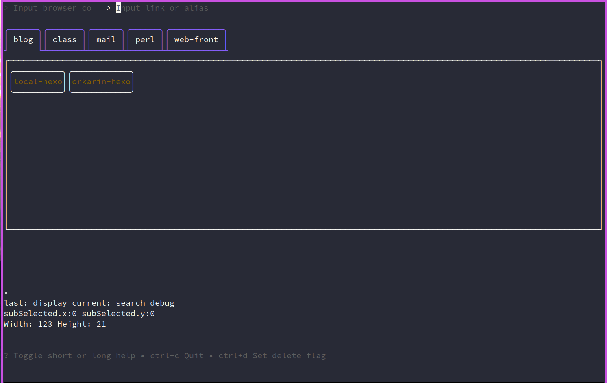
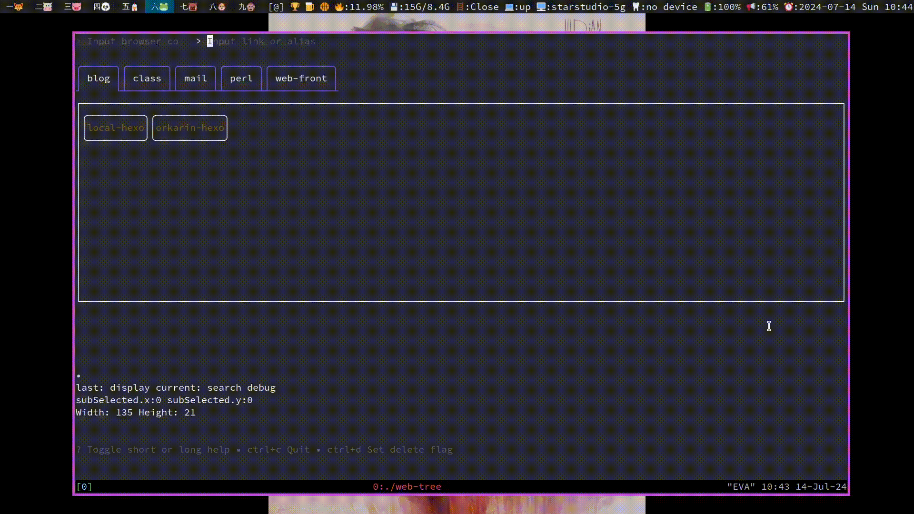

# Description
Using bubbletea and libgloss to write a web favorates handler for command line usage.



It's still in the development stage, and I'm dealing with problems with the UI components. Code comments and documentation will be written soon. Bugs are being fixed along the way!
# Targets

    Have a nice UI, customization of UI components'position, maybe drag with mouse and store the new position parameter
    Add/delete web ✅
    Could add description for each web ✅
    Multiple name alias for each web page ✅
    Scroll bar
    Open a web page through target web browser ✅
    Icon setting for each web page
    Fuzzy finder ✅
    Classification support
    Vim mode for moving around and search space ✅
    Maybe customization for keybindings
    YMAL configuration file ✅
    Custom sort way: folder, label
    Flip between description and link ✅
    Copy the link to clipboard ✅
    Edit link and description in real time ✅
    Basic help info on the top, could be hidden ✅
    Check whether the keybindings is conflict
    Configuration file should be placed at "~/.config/web-tree/" ✅
    Every tree have a storage file? data 目录, 每创建一个 tree, 就添加一个文件 ✅
    Check configuration
    Move a node to another position ✅
    Browser list show ✅
    Sort method, tree? node? label and so on.

# Mode
Press specific keys to enter different modes:
    
|Mode|Key|Desc
-|-
Display|ESC|From any mode
Search|Ctrl+n|From any mode.
AdSearch|Ctrl+u|From any mode
Browser|Ctrl+o|From any mode
Add|Ctrl+a|From display mode
Edit|Ctrl+e|From display mode

## Search
 Fuzzy find a web node:
- `<Tab>` for autocompletion
- `<Ctrl+j>` to move down
- `<Ctrl+k>` to move up
- `Enter` to jump to specific node


## Advanced Search
Using tree path (web folder), links, alias, and labels to find a node:
- `<Tab>` for autocompletion
- `<Ctrl+j>` to move down
- `<Ctrl+k>` to move up
- `Enter` to jump to specific node

<video width="960" height="540" controls>
  <source src="./.github/mp4/adsearch.mp4" type="video/mp4">
</video>

## Add
Add new subtree (web folder) or node:
- `<Ctrl+j>` to move down
- `<Ctrl+k>` to move up
- `Enter` to jump to specific node

<video width="960" height="540" controls>
  <source src="./.github/mp4/add.mp4" type="video/mp4">
</video>

## Browser
Chose browser for opening a web link, default value is the first one setting in configuration file:

<video width="960" height="540" controls>
  <source src="./.github/mp4/browser.mp4" type="video/mp4">
</video>

## Display
Navigate subtrees and nodes:
- `h` for left
- `l` for right
- `k` for up
- `j` for down
- `ctrl+x` for opening link
- `ctrl+e` for editing node
- `ctrl+t` for toggling display info

<video width="960" height="540" controls>
  <source src="./.github/mp4/display.mp4" type="video/mp4">
</video>

# Cmd
> Open tui

```sh
webtree
```

### root
> Open with browser in conf file by alias

```sh
webtree --tree=<name> --node --alias=<alias>
```

> Open with browser in conf file by link

```sh
webtree --tree=<name> --node --link=<url>
```

> Target browser

```sh
webtree --tree=<name> --node --alias=<alias> --browser=firefox
```

### add
> Add a new web folder:

```sh
webtree add --tree=<name> 
```
> Add a new web folder with sub folder:

```sh
webtree add --tree=<name>/<subname>/<subsubname> 
```
> Add multiple tree

```sh
webtree add --tree=<name>/<subname>/<subsubname>,<another>
```
> Add a new node to a tree (at lease url and alias):

```sh
webtree add --tree=<name>/<subname> --node --link=<url1>,<url2> --alias=<alias1>,<alias2> --desc=<desc1>,<desc2> --label=<label1>,<label2>
```

### delete
> Delete a tree

```sh
webtree del --tree=<name>/<subname>
```
> Delete multiple trees

```sh
webtree del --tree=<name>/<subname>,<another>
```
> Delete a node by url

```sh
webtree del --tree=<name> --node --link=<url>
```
> Delete a node by alias

```sh
webtree del --tree=<name> --node --alias=<alias>
```

### edit
> Edit a tree name

```sh
webtree edit --tree=<name> --tname=<newname>
```

> Edit a node chosen by link

```sh
webtree edit --tree=<name> --node --link=<url> --nlink=<newlink> --nalias=<newalias> --ndesc=<newdesc> --nlabel=<newlabel>
```

> Edit a node chosen by alias

```sh
webtree edit --tree=<name> --node --alias=<alias> --nlink=<newlink> --nalias=<newalias> --ndesc=<newdesc> --nlabel=<newlabel>
```

### move
> Move a tree as a subtree of another tree

```sh
webtree move --tree=<name> <another tree name>
```

> Move a node to another tree

```sh
webtree move --tree=<name> --node --alias=<alias> <another tree name>
```

### list
> List all trees

```sh
webtree list tree
```
> List all nodes

```sh
webtree list node
```
> List all tags/labels

```sh
webtree list label
```
> List all styles

```sh
webtree list style
```
### show
> Show detail of a tree

```sh
webtree show --tree=<name>
```
> Show detail of a node

```sh
webtree show --tree=<name> --node --link=<url>
```
or:
```sh
webtree show --tree=<name> --node --alias=<alias>
```
> Show detail of a label

```sh
webtree show --label=<name>
```

# Installation
You should not install this version, it's still hard to use, I will implement these problems in the following days.
